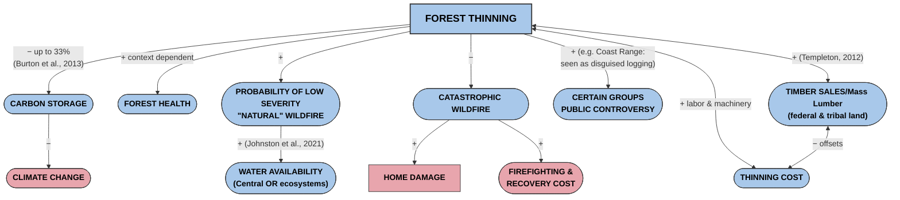

```mermaid

flowchart TB
    FT["FOREST THINNING"]

    CS(["CARBON STORAGE"])
    CC(["CLIMATE CHANGE"])
    FH(["FOREST HEALTH"])
    LSW(["PROBABILITY OF LOW SEVERITY<br/>#quot;NATURAL#quot; WILDFIRE"])
    WA(["WATER AVAILABILITY<br/>(Central OR ecosystems)"])
    CW(["CATASTROPHIC WILDFIRE"])
    HD["HOME DAMAGE"]
    FRC(["FIREFIGHTING &<br/>RECOVERY COST"])
    PC(["CERTAIN GROUPS<br/>PUBLIC CONTROVERSY"])
    TS(["TIMBER SALES/Mass Lumber<br/>(federal & tribal land)"])
    CO(["THINNING COST"])

    FT -- "− up to 33%<br/>(Burton et al., 2013)" --> CS
    CS -- "−" --> CC
    FT -- "+ context dependent" --> FH
    FT -- "+" --> LSW
    LSW -- "+ (Johnston et al., 2021)" --> WA
    FT -- "−" --> CW
    CW -- "+" --> HD
    CW -- "+" --> FRC
    FT -- "+ (e.g. Coast Range:<br/>seen as disguised logging)" --> PC
    FT -- "+ (Templeton, 2012)" <--> TS
  
    FT -- "+ labor & machinery" <--> CO
    TS <-- "− offsets" --> CO
   

    classDef center fill:#a8c8ea,stroke:#333,stroke-width:2px,color:#000,font-weight:bold,font-size:20px
    classDef effect fill:#a8c8ea,stroke:#333,color:#000,font-weight:bold
    classDef impact fill:#e8a5ad,stroke:#333,color:#000,font-weight:bold

    class FT center
    class CS,FH,LSW,WA,CW,PC,TS,ML,CO effect
    class HD,FRC,CC impact
```
